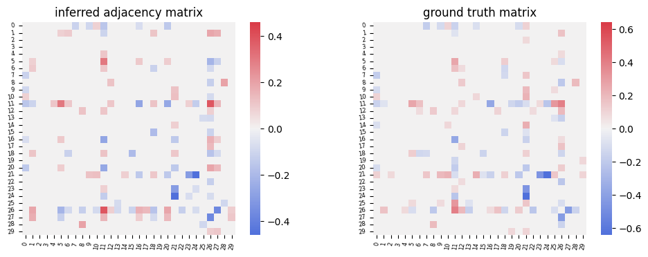

# FSDiffNet: Flippable Siamese Differential Neural Network for Differential Graph Inference

[](https://pepy.tech/project/fsdiffnet) 

## Introduction

Directly comparing and subtracting two networks can result in the loss of a lot of information, while traditional differential network inference algorithms require $O(p^3)$ time complexity. We propose a novel Flippable Siamese Differential neural Network (FSDiffNet) architecture for differential graph inference problems. Theoretically, we first introduce the concept of filppability and the theoretical aspects of flippable neural networks, establishing the necessary conditions for constructing a flippable neural network. This theory guides our architectural and component design, such as the softsparse activation function and high-dilation circular padding diagonal convolution, leading to the construction of FSDiffNet. Its training consists of two phases: The first phase learns the inference of a single-condition network. The second phase utilizes the pre-trained parameters from the first phase as the shared parameters of siamese network, and generate differential features to fine-tune for learning the inference of the differential network.  Finally, in experiments on datasets of patients with autism, FSDiffNet successfully recovered the differential functional connectivity maps of ROIs, particularly identifying weakened connection patterns in the DMN within the ASD group; in the breast cancer dataset, it inferred large-scale networks and successfully identified the NDRG2 gene closely related to survival analysis, aiding researchers in better understanding the driving differences in disease.

## Requirements

To avoid conflicts between packages, we recommend that you first create a brand new virtual environment before proceeding with the package installation:

```bash
conda create --name fsdiffnet python=3.10.13
```

and then activate the virtual environment:

```bash
conda activate fsdiffnet
```

### R requirements

`rpy2` enables the invocation of the `BDgraph` R package for generating simulation data. We recommend using `R-4.3.1`.

We recommend you follow the steps below for R package installation:

1. Install R in your conda environment:

    ```bash
    conda install -c conda-forge r-base
    ```

2. Install `BDgraph` R package.

    ```r
    conda install -c conda-forge r-BDgraph
    ```
    
### Python requirements
    
Details on the versions of the required packages are provided in [requirements.txt](./requirements.txt)

We recommend you follow the steps below for Python package installation:

1. Install [pytorch](https://pytorch.org/) first according to your CUDA version;\
    or  if your CUDA version > 11.3, you can install using the following command:

    ```bash
    pip install torch==1.12.1+cu113 torchvision==0.13.1+cu113 torchaudio==0.12.1 --extra-index-url https://download.pytorch.org/whl/cu113
    ```

2. Install the dependencies using requirements.txt.

    ```bash
    pip install -r requirements.txt
    ```


### Note

If you have multiple versions of R installed, specify the version associated with the above packages using:

```python
import os
os.environ["R_HOME"] = "your path to R"
```

## Installation

One line for installation:

```bash
pip install fsdiffnet
```

You can also install the packages locally by downloading our repository:

```bash
git clone https://github.com/amssljc/FSDiffNet.git
cd FSDiffNet
pip install -e .
```

## Quickstart

```python
import numpy as np
import torch
import matplotlib.pyplot as plt

from fsdiffnet.infer import infer_differential_graph
from fsdiffnet.generate_data import ExpressionProfiles
from fsdiffnet.utils import show_matrix, remove_diag, keep_largest_k, vec2mat, seed_everything, calculate_flip_error

seed_everything(1)
data_params = {
    'p': [30],
    'n': 1000,
    'sample_n': 10,
    'repeats': 1,
    'sparsity': [0.1, 0.3],
    'diff_ratio': [0.3, 0.7],
    'net_rand_mode': 'BA',
    'diff_mode': 'hub',
    'target_type': 'float',
    'usage': 'comparison',
    'flip': True,
    'withdiag': True,
    'sigma_diag': True
}
example_data = ExpressionProfiles(
        **data_params
    )

(sigma, delta, *X) = example_data[0] # X is a list of expression profiles X1, X2, each with a shape of (n, p), in this case, (1000, 39).
cov1 = np.corrcoef(X[0].T)
cov2 = np.corrcoef(X[1].T)

input = np.stack((cov1, cov2))
input = input[np.newaxis, :]
input = torch.tensor(input).float()

# inferring step
inferred_matrix = infer_differential_graph(input)

inferred_matrix = keep_largest_k(remove_diag(inferred_matrix), data_params['p'][0]*4)
ground_truth = keep_largest_k(vec2mat(delta)[0], data_params['p'][0]*4)

fig, axes = plt.subplots(1, 2, figsize = (12,4))
show_matrix(inferred_matrix, ax = axes[0], title='inferred adjacency matrix')
show_matrix(ground_truth, ax = axes[1], title='ground truth matrix')
plt.show()
```



## Examples and tutorials

We have provided two real data cases related to the paper as reproducible result notebooks, along with a tutorial notebook verifying that the flip error of FSDiffNet can reach the theoretical lower bound:

1. [ABIDE](./notebooks/ABIDE.ipynb)
2. [BRCA](./notebooks/BRCA.ipynb)
3. [Flip error](./notebooks/quickstart.ipynb)

## Neural Network Paramaters

We've incorporated pre-trained neural network parameters in the package to facilitate rapid and convenient inference, which can be directly executed with:

```python
inferred_mat = infer_differential_graph(input)
```

Alternatively, you have the option to train your own network parameters by executing `main.py`.
